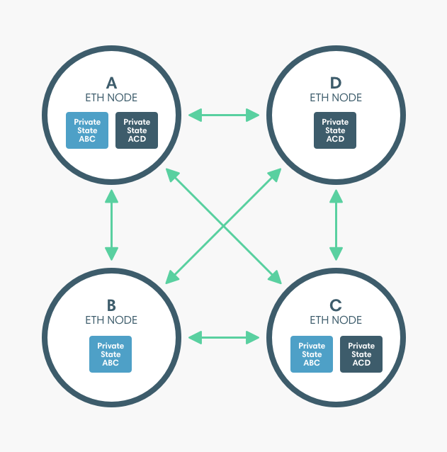

description: Privacy
<!--- END of page meta data -->

# Privacy Groups 

A privacy group is a group of nodes identified by a unique privacy group ID by Orion. Each private transaction is 
stored in Orion with the privacy group ID.

The Pantheon nodes maintain the public world state for the blockchain and a private state for each privacy group. 
The private states contain data that is not shared in the globally replicated world state. Private transactions read 
and write to the private world state for the privacy group, and read from the public world state.

Contracts have the following levels of access between public and private states:

* A contract from a privacy group can read and write to another contract in the same privacy group.
* A contract from a privacy group can read from the public state including public contracts.
* A contract from a privacy group cannot access contracts from a different privacy group.
* A public contract cannot access a private contract.

## Privacy Types 

Pantheon implements two types of privacy: 

* EEA-compliant privacy - private transactions include `privateFor` as the recipient.
* Pantheon-extended privacy - private transactions include `privacyGroupId` as the recipient.

Both privacy types create privacy groups and store private transactions with their privacy group in Orion. 

!!! note
    The Orion nodes are not shown above for clarity only.  To send private transactions, 
    each Pantheon node must have an associated Orion node. 

### EEA-compliant Privacy 

In our privacy implementation complying with the [EEA Client Specification](https://entethalliance.org/technical-documents/)
the group of nodes specified by `privateFrom`and `privateFor` form a privacy group and are given a unique 
privacy group ID by Orion.  

!!! example 
    The diagram above illustrates two privacy groups enabling: 

    * A, B, and C to send transactions that are private from D 
    * A, C, and D to send transactions that are private from B 

    Using EEA-compliant privacy, to send private transactions between A, B, and C, A initialises a contract in a private transaction with
    B and C specified as the `privateFor` and A specified as the `privateFrom`. Initialising the contract 
    creates a privacy group consisting of A, B, and C. For the ABC private state to remain consistent, 
    A, B, and C must be included on transactions (as either `privateFrom` or `privateFor`) even if they are 
    between two of the three parties.

    To send private transactions between A, C, and D, C initialises a different contract in a private transaction with
    A and D specified as the `privateFor` and C specified as the `privateFrom`. Initialising the contract 
    creates a privacy group consisting of  A, C, and D. For the ACD private state to remain consistent, 
    A, C, and D must be included on transactions (as either `privateFrom` or `privateFor`) even if they are 
    between two of the three parties.

### Pantheon-extended Privacy 
 
In our extended privacy implementation, a privacy group is created using [`priv_createPrivacyGroup`](../../Reference/Pantheon-API-Methods.md#priv_createprivacygroup)
and private transactions sent to the privacy group ID. 

!!! example 
    Using the same privacy groups as above. 

    Using Pantheon-extended privacy, to send private transactions between A, B, and C, A creates a privacy 
    group consisting of A, B, and C. The privacy group ID is specified when sending private transactions and 
    A, B, and C are recipients of all private transactions sent to the privacy group. 

    To send private transactions between A, C, and D, A creates a privacy group consisting of A, C, and D.
    The privacy group ID of this group is specified when sending private transactions with A, C, and D 
    as recipients. 